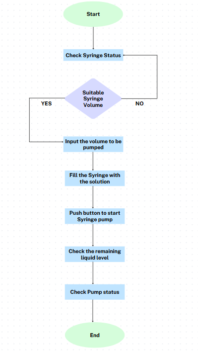
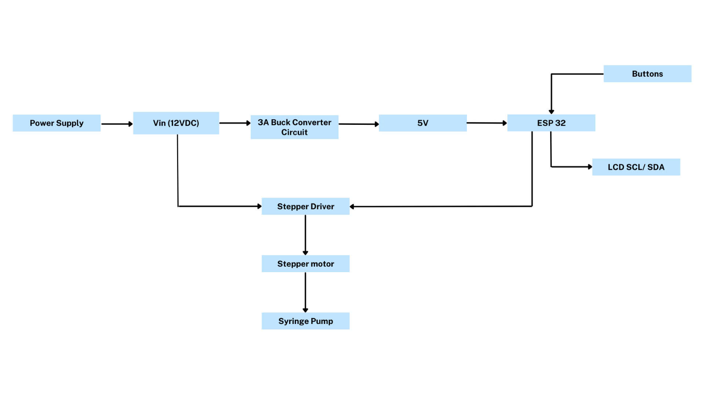
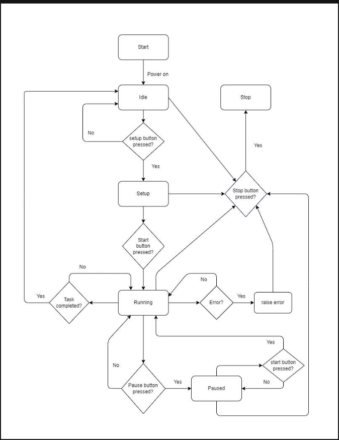

# Final project: Syringe pump
## Team members
[Nguyen Minh Khon - BEBEIU21225]
[Dang Mai Nhung - BEBEIU21254]
[Nguyen Hoang Long - BEBEIU20215]
[Pham Xuan Hoc - BEBEIU20292]
[Nguyen Le Ngoc Thanh Thuy - BEBEIU21275]
## Introduction 
A syringe pump is a device used to deliver precise amounts of fluid at specific intervals. It is commonly used in medical, laboratory, and industrial settings. Syringe pumps are critical in applications requiring high accuracy and control, such as drug delivery, chemical reactions, and research experiments.
## Objective 
The objective of this syringe pump project is to design and develop a precise fluid delivery device suitable for medical, laboratory, and industrial applications. The project aims to ensure high accuracy in fluid dispensing, provide a user-friendly interface, enhance reliability and safety, and support various use cases. Additionally, it seeks to integrate advanced features such as programmable flow rates and real-time monitoring to offer a versatile and robust tool for precise fluid management across multiple domains.
## Flowchart
  
## Blockdiagram 
  
## Statediagram
  

